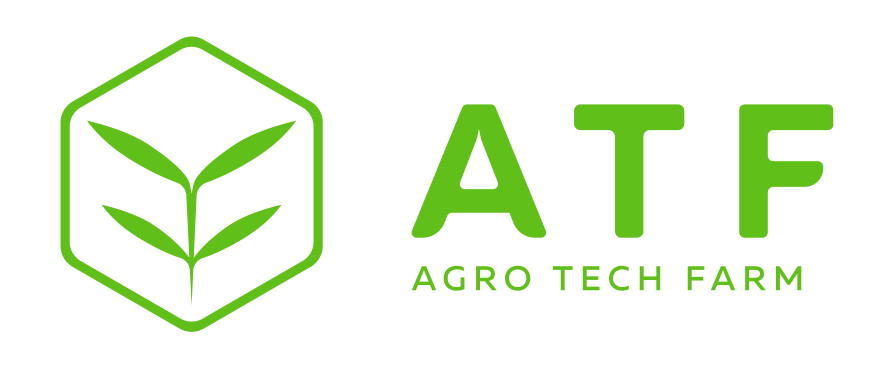

**General Overview**

Token Name|Agro TechFarm(ATF)
---|---
Decimals|18
Smallest Unit (Atom)|1e-18 ATF
Token Amount|Up to 1,431,000 ATFs
Token Price|1 ATF=0.012 ETH
Percentage for sale|100%
Minimum Token Purchase|1 Wei
Maximum Token Purchase|No Limit

**1. Token Amount**

The maximum token amount is 1,431 000 ATFs.
Tokens are minted during the crowdsale and the total supply is fixed at the end of the crowdsale so that the maximum token amount might not be reached.
In case the maximum number should be reached, the crowdsale allows for up to 1,514 atoms to be created due to arithmetic imprecisions.

**2. ICO Phases**

Phases|Date
---|---
Starting Date (Pre-SALE)|16 February 2018
Ending Date (PRE-SALE)|20 April 2018
Starting Date (Private-SALE)|21 April 2018
Ending Date (Private-SALE)|31 May 2018
Starting Date (ICO)|1 June 2018
Ending Date (ICO)|31 July 2018

**3. ICO Price & Bonus**

***PRE-ICO***

Day|Price|Equivalent Bonus
---|---|---
All|1 ATF=0.012 ETH|40%

***ICO***

Week|Price|Equivalent Bonus
---|---|---
1-2|1 ATF=0.012 ETH|+20% tokens
3-4|1 ATF=0.012 ETH|+10% tokens
5-6|1 ATF=0.012 ETH|+5% tokens

For further information please visit our website https://www.agrotechfarm.io/ or blog
https://medium.com/@agro_tech_farm/about-agrotechfarm-ae879b58d339
